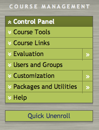
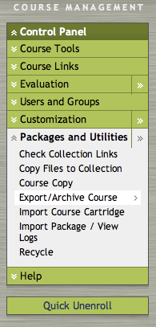
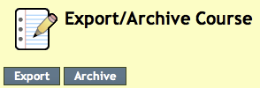

Exporting From Blackboard
=========================

Before converting a course with Reteach, you must export it from Blackboard in
the correct format.

First, navigate to the course you want to export

Locate the Course Management Control Panel.

.. note::

   If you do not have access to the Course Management Control Panel, contact
   you system administrator.

Click on Packages and Utilites, then click on Export/Archive Course.

Click the Export button.

.. note::

   Reteach is not designed to work with archive files. Only use export files.

Select the Course Materials you want to export.

Upon clicking Submit, your course will be exported on the Blackboard server.

Check the Export/Archive Course page periodically for your new export file to
appear in the list of downloadable files.
